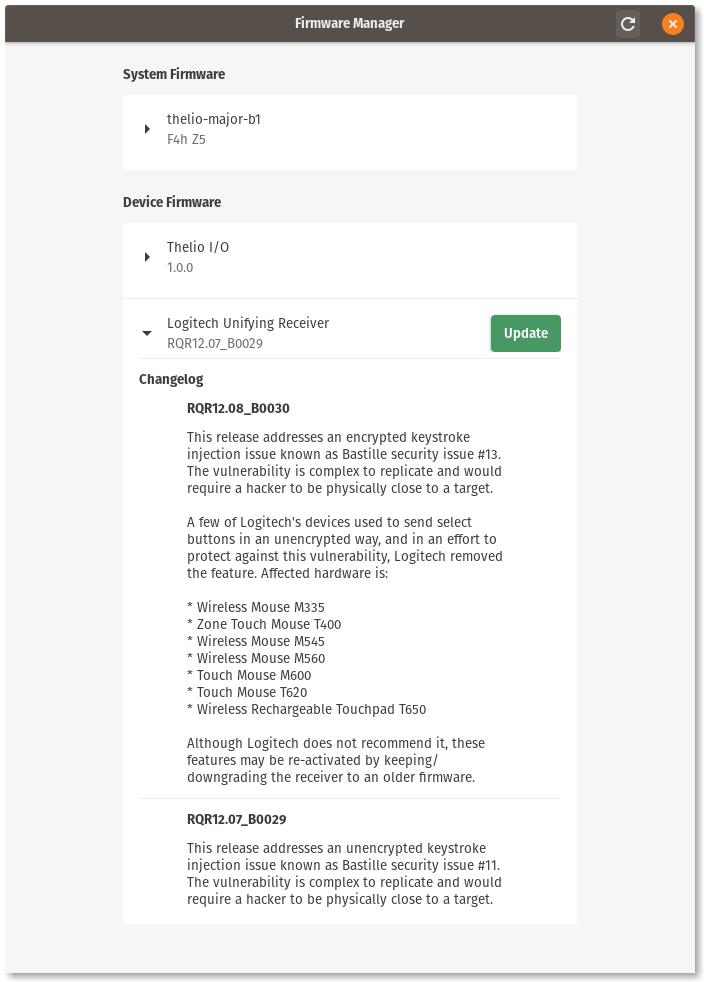
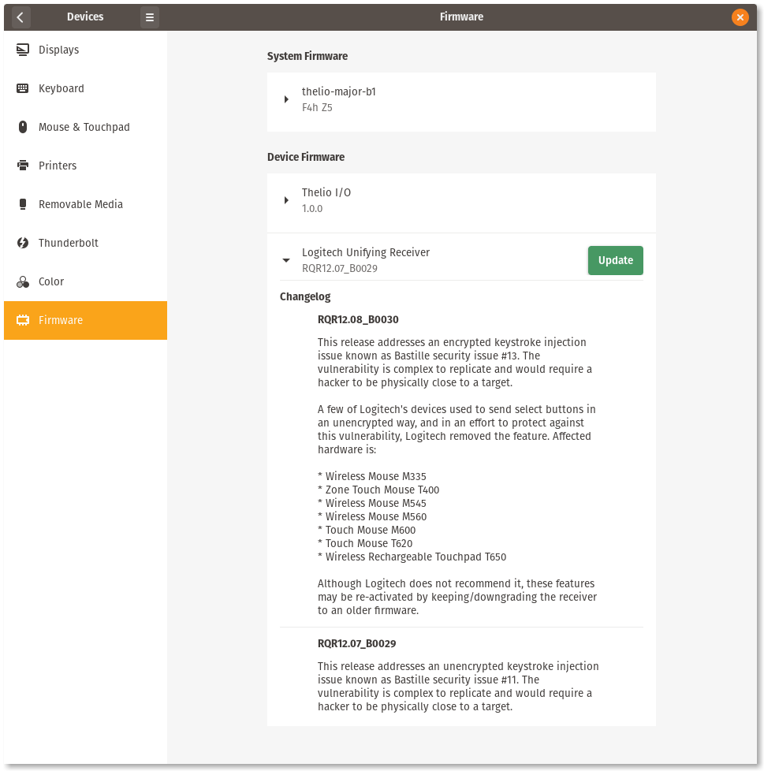

# Firmware Manager

One of the remaining issues with firmware management on Linux is the lack of options for graphical frontends to firmware management services like `fwupd` and `system76-firmware`. For `fwupd`, the only solutions available were to distribute either GNOME Software, or KDE Discover; which is not viable for Linux distributions which have their own application centers, or frontends to package managers. For `system76-firmware`, an official GTK application exists, but it only supports updating System76 firmware, when it would be more ideal if it could support both.

> `fwupd` is a system service which connects to [LVFS](https://fwupd.org/) to check for firmware updates to a wide variety of hardware from multiple vendors. `system76-firmware` is our own system service which connects to System76 to check for firmware updates for System76 hardware.

To solve this problem, we've been working on the [Firmware Manager](https://github.com/pop-os/firmware-manager) project, which we will be shipping in both Pop!_OS and Ubuntu. It supports both `fwupd` and `system76-firmware`, is Wayland-compatible, and provides both a GTK application and GTK library. In Pop!_OS, it will be integrated into GNOME Settings in a new **Firmware** panel under the **Devices** category using the GTK library. For Ubuntu, the GTK application will be provided, rather than integrated into GNOME Settings.

> Wayland disallows applications from being run as root, so applications must either call `pkexec` to prompt the user for permission to run a background process that is root, or connect to an existing background service provided the needed capabilities.

## GTK Application

Ubuntu, and other Linux distributions which would prefer to have a standalone desktop application, are free to use the included GTK application.




## GNOME Settings Integration

Pop!_OS will be integrating a patch into GNOME Settings which embeds the GTK widget into a new **Firmware** panel in the **Devices** category section.



## Implementation Details

Like all of our projects today, it is written in Rust, and adheres to current best practices. The project is configured as a workspace, with the core crate providing a generic library for discovering and managing firmware from multiple firmware services. Both `fwupd` and `system76-firmware` are supported. The core is used as the foundation for the two members of this workspace: a notification binary to provide desktop notifications about firmware updates; and a GTK project which serves as both a widget library and desktop application.

**Visualization of project structure**

```
* firmware-manager
    * firmware-manager-notify
    * firmware-manager-gtk
        * firmware-manager-gtk-ffi
```

The `firmware-manager` library provides functions for scanning firmware, and an event loop which receives and sends signals through channels. This is designed to be run in a background thread to prevent a UI that uses the firmware manager from blocking as requests are being processed. Additionally, the event API is expected to be used with the provided `slotmap`-based entity-component architecture. This allows a frontend to assign entity IDs to their requests, and receive those entity IDs back in responses. In doing so, frontends can avoid the need for complex runtime reference-counnting, or creating reference cycles.

The `firmware-manager-gtk` member of the project provides the firmware widget as a library, and an application which places that widget into a window. This member contains a C FFI sub-member, which builds a dynamic library with a C API and header, and can be used to integrate the widget into any GTK application written in C. The included GTK application statically-links the Rust widget library. This implementation takes full advantage of the slotmap EC, assigning its own component storages to keep track of state relative to a device entity, such as the widgets assigned to an entity, and information about their firmware.

The `firmware-manager-notify` member comes with a systemd user timer so that it is executed at login, and then periodically run again at set intervals to check for updates again. When updates are found, a clickable notification will be displayed, which will either open the Firmware panel in GNOME Settings, or the standalone desktop application, depending on which is available on the system.

### Supporting Other Frontends

Although the project will release with only a GTK frontend, it is possible for anyone to use it as the foundations for developing a frontend written in any other graphical toolkit. All functionality in the core library is GUI-agnostic, and the entity-component architecture can be extended to their specialized needs. If you write a frontend for another toolkit and want it included in the project, feel free to submit a pull request!

### How to Implement Frontend Support

Frontends are expected to store information about devices in the included entity-component architecture in the `firmware-manager`. Events sent to firmware manager's event loop requires the entity IDs to be sent along with messages. This makes it easier to keep cyclic references out of widget signals, and to identify which firmware a response is referring to. Widgets belonging to a specific firmware device need only send a message through their sender with their attached entity ID.

## Build Instructions

This project uses a Makefile. When building the application, the `prefix` flag must be provided, so that the desktop entry file is generated to point to the correct path of the target binary after installation.

```sh
make prefix=/usr features='fwupd system76'
sudo make install prefix=/usr
```

Note that the generated desktop entry is stored in the `target` directory, where the `pkgconfig` file is also stored after it is generated. If you need to regenerate the desktop entry with a different prefix, you can manually call the `desktop` rule.

```
make desktop prefix=/usr
```

### Conditional Features

There are also two conditional features of the crate:

- `system76`: enables support for the system76-firmware daemon
- `fwupd`: enables support for the fwupd DBus daemon

If no feature is provided to `make`, the default is to enable both.

### Debug Binaries

To build a debug binary, pass `DEBUG=1` into make.

```sh
make prefix=/usr features='fwupd system76' DEBUG=1
sudo make install DEBUG=1
```

### Vendoring

To vendor the project for packaging, call `make vendor`. To build a project that has been vendored, pass `VENDOR=1` to the makefile.

```sh
make vendor
make prefix=/usr features='fwupd system76' VENDOR=1
```

## API Overview

This section provides details about the API and how to call it from Rust or C.

### Rust API

The primary API, which the C API is based upon. An example of the Rust API in practice in a GTK application can be found [here](./src/main.rs).

```rust
use firmware_manager_gtk::FirmwareWidget;

// Create a new firmware widget
//
// This spawns a background thread which listens for widget events until
// the `Quit` signal is received, which occurs when the firmware widget
// is dropped.
let mut firmware = FirmwareWidget::new();

// Signal the widget's background thread to begin scanning for firmware.
firmware.scan();

// Get the GTK widget from the firmware widget to add into a window.
let widget = firmware.container();
```

### C API

The Rust library also supports C interface with FFI rules in the Makefile for gnerating a dynamic C library with `pkg-config` support. This is integrated in GNOME Settings on Pop!_OS.

```sh
make ffi prefix=/usr features='system76 fwupd'
sudo make install-ffi prefix=/usr
```

Which can then be imported into a C code base with:

```c
#include <s76_firmware.h>

// Create a new firmware widget
S76FirmwareWidget *firmware =
    s76_firmware_widget_new ();

// Signal the widget's background thread to begin scanning for firmware.
s76_firmware_widget_scan (firmware);

// Get the GTK widget from the firmware widget to attach it to a container.
GtkWidget *firmware_widget =
    s76_firmware_widget_container (firmware);

// Destroy the widget and signal its background thread to quit.
s76_firmware_widget_destroy (firmware);
```

The C implementation of the Rust application is [here](./ffi/examples/c), demonstrated with the Meson build system.
